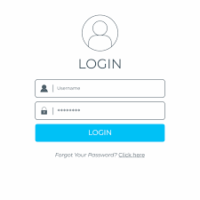
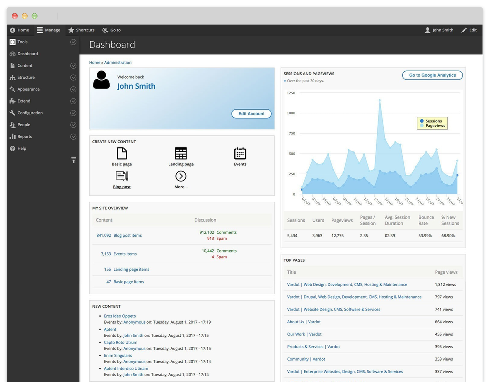

Drupal is a free and open-source web content management system written in PHP.

##### ➡️ This deployment uses the official Drupal Docker image.  

➡️ Go to create apps page and Search Drupal on the search bar.

➡️ Click on install button.

➡️ Fill all the reqired feilds.

| PRODUCT NAME  |
| :--------     | 
| `drupal`      |

`PROTOCOL`

| HTTP          | TCP/UDP       |
| :--------     | :--------     |
| `80`          |               |

➡️ click on Advanced.

| ENV VARIABLE                                                                                                                  |  WHITELIST                                                       |        WORKING DIR          |
| :---------                                                                                                                    | :--------                                                        |:----------------------------| 
| `You can set multiple ENV for database connection` `MYSQL_DATABASE, MYSQL_USER`, `MYSQL_PASSWORD`, and `MYSQL_ROOT_PASSWORD`  | `If you want to white list any ports list here`                  |`WORKDIR for the application`|

➡️ Click on the Install button.

➡️ You will be redirected to My Apps page, Here you can find all the applications you deployed.

➡️ Copy the Drupal application Hostname without NodePort and search the Url. 

➡️ Now you can access the Drupal login page.

➡️ Then you will be redirected to the Drupal dashboard page.

