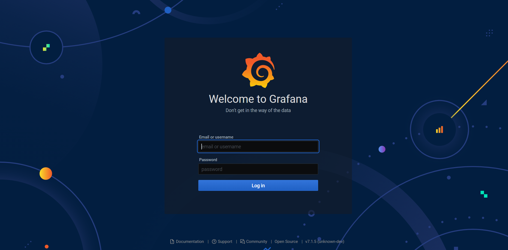
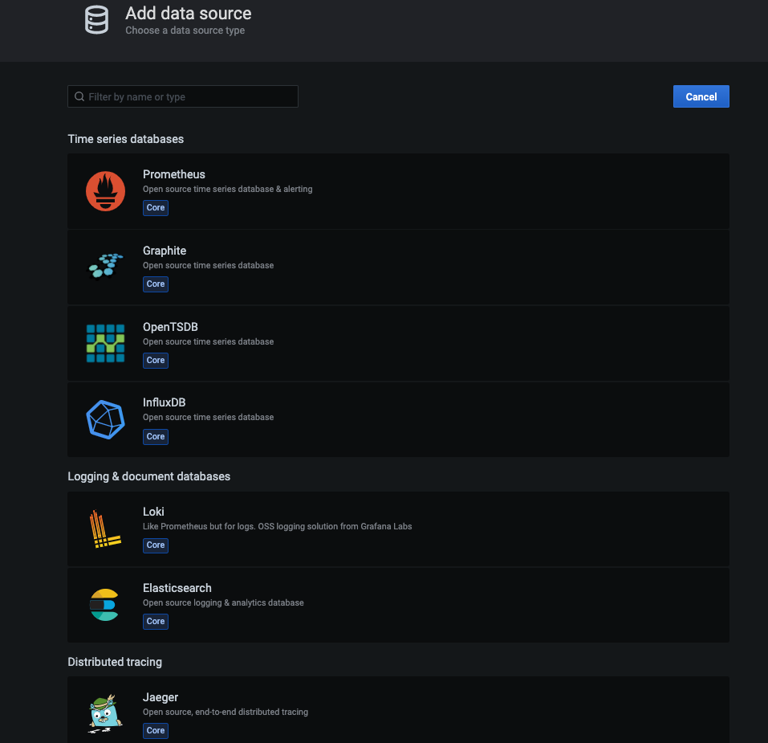
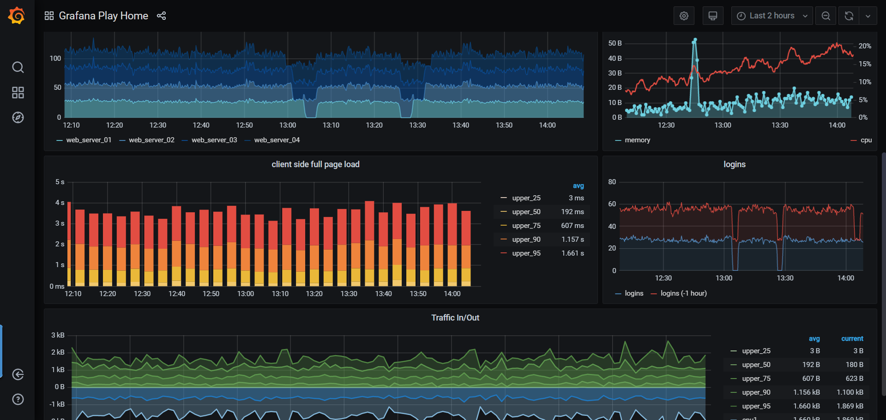

Grafana is a multi-platform open source analytics and interactive visualization web application. It provides charts, graphs, and alerts for the web when connected to supported data sources.

➡️ Go to create apps page and Search grafana on the search bar.

➡️ Click on install button.

➡️ Fill all the reqired feilds.

| PRODUCT NAME  |
| :--------     | 
| `grafana`    |

`PROTOCOL`

| HTTP          | TCP/UDP       |
| :--------     | :--------     |
| `3000,90`       | `3306,5432`   |

➡️ click on next.

| PORT NUMBER   |
| :--------     |
| `default 22`  |

➡️ click on next.

| ENV VARIABLE         |  WHITELIST                                                       |        WORKING DIR          |
| :---------           | :--------                                                        |:----------------------------| 
| `Give env variable`  | `If you want to white list any ports list here` `Example` `82`   |`WORKDIR for the application`|

➡️ Click on the Finish button.

➡️ You will be redirected to My Apps page, Here you can find all the applications you deployed.

➡️ Copy the grafana application Hostname without NodePort and search the Url. 

➡️ Change the port in the starting of Url to port 3000 to access the application.

➡️ Now you will access the application. And you need to login to grafana.

➡️ Default Username and Password for grafana is admin.

➡️ After you will be required to add datasources and create dashboards to visualize your data.

`ADD DATASOURCE`

➡️ Now you can create the dashboard and select the data source to visualize the data you need.

