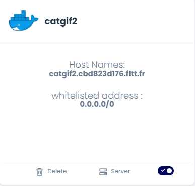
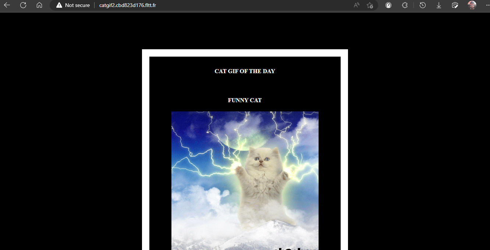

➡️ The code for the application is uploaded on github.

[Github Link](https://github.com/younesfakallah/catgifFront)

➡️Make sure you have your dockerhub account linked to scaleinfinte you can find the process here [Link](../../../../quick_start/my_account/_index.md)

➡️ Use [Build image](../../../../quick_start/build_image/_index.md) page to create a docker image and push into your docker hub account.

➡️ Search the docker image you have created in Create app page.

➡️ Click on the Install button.

➡️ Fill all the reqired feilds.

| PRODUCT NAME  |
| :--------     | 
| `<name of docker image>`      |

`PROTOCOL`

| HTTP          | TCP/UDP       |
| :--------     | :--------     |
| `80`          |               |

➡️ click on Advanced.

| ENV VARIABLE                                                                                                                  |  WHITELIST                                                       |        WORKING DIR          |
| :---------                                                                                                                    | :--------                                                        |:----------------------------| 
| `You can set multiple ENV for database connection` `MYSQL_DATABASE, MYSQL_USER`, `MYSQL_PASSWORD`, and `MYSQL_ROOT_PASSWORD`  | `If you want to white list any ports list here`                  |`WORKDIR for the application`|

➡️ You will be redirected to My Apps page, Here you can find all the applications you deployed.

➡️ Copy the application Hostname without NodePort and search the Url. 

➡️ The Application is running successfully

## FAQ

#### Can i install my own Static Application?

Absolutely, you can install your own Static applcation, Make Sure you have proper Docker image created on your dockerhub.