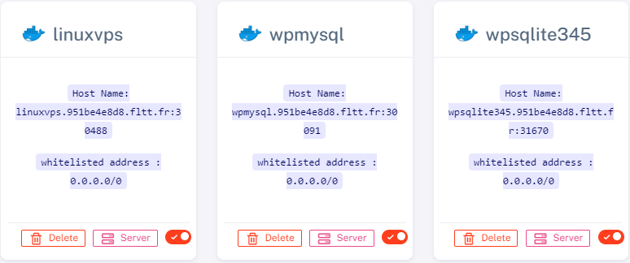
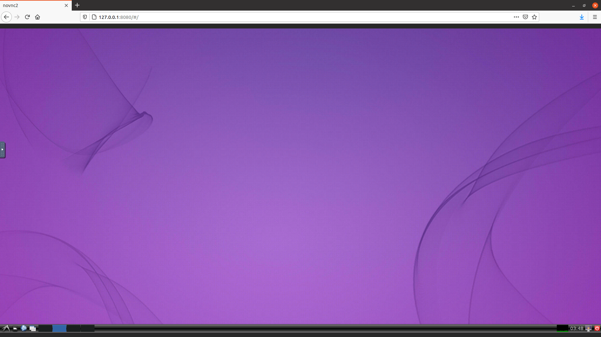
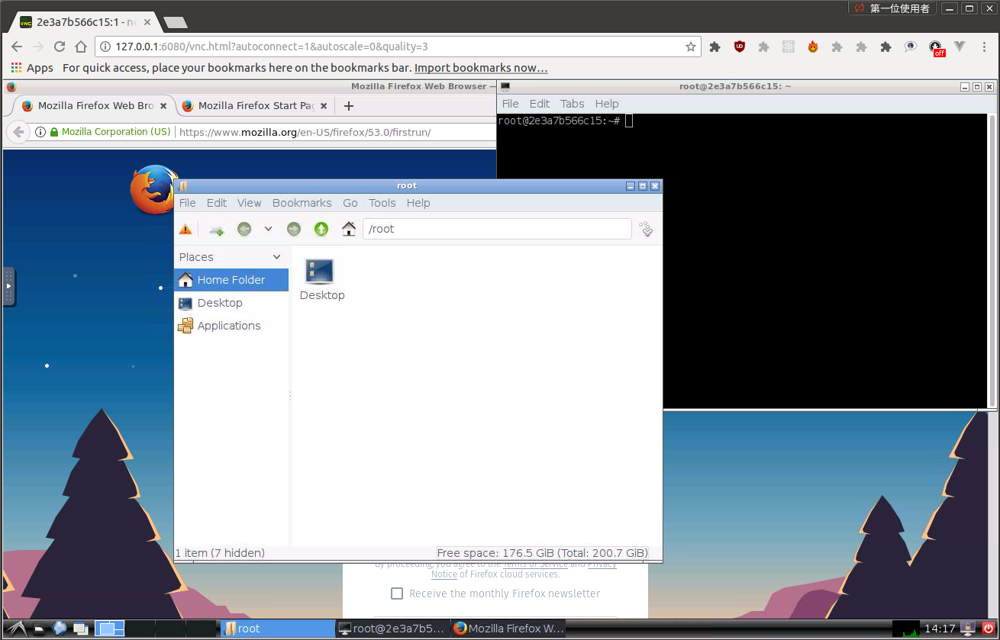

The linux vps is a virtual private server in contain that you can spinup in secconds ,connect and use. This is same as you personal computer.  


##### ➡️ Docker image of this application consists of following layers :
```
'FROM ubuntu:20.04' Taking ubuntu:20.04 as the base image.

And updating and installing all the required packages like 'supervisor' a system that allows users to monitor and control a number of processes 'nginx' 'xz-utils' 'dbus-x11' 'dbus-x11' and important tools like 'net-tools'  for controlling the network subsystem of the Linux kernel.

Then installed the 'vim-tiny' 'firefox' 'lxde' and 'vnc' virtual network computing software is very impportant for this application.

And 'copying' all the required files to the image.

Exposing the port '80' to access the vps.

``` 

### Deploy LinuxVPS on Scaleinfinite

➡️ Go to create apps page and Search scaleinfinite/linuxvps on the search bar.

➡️ Click on install button. 

➡️ Fill all the reqired feilds.

| PRODUCT NAME  |
| :--------     | 
| `Linux VPS`     |

`PROTOCOL`

| HTTP          | TCP/UDP       |
| :--------     | :--------     |
| `80`          |               |

➡️ click on Advanced.

| ENV VARIABLE         |  WHITELIST                                                       |        WORKING DIR          |
| :---------           | :--------                                                        |:----------------------------| 
| `Give env variable`  | `If you want to white list any ports list here` `Example` `82`   |`WORKDIR for the application`|

➡️ Click on the Insatll button.

➡️ You will be redirected to My Apps page, Here you can find all the applications you deployed.



➡️ Copy the Linuxvps application Hostname without NodePort and search the Url. 

➡️ Now you can see a similar window like this. 



➡️ From pressing the LADE symbol button you can access to terminal and file-system etc..,




