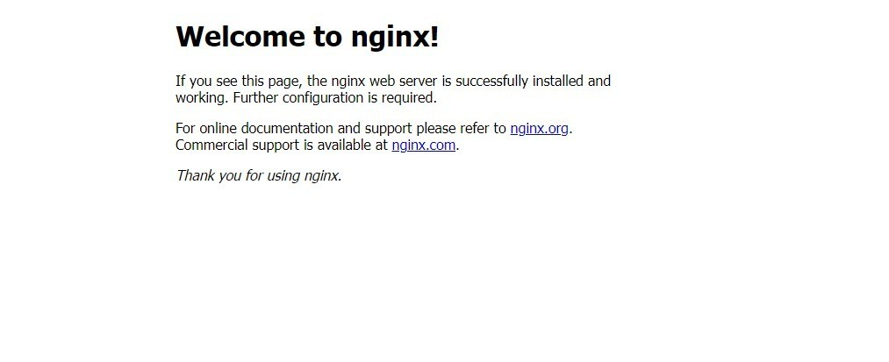

Nginx is a web server that can also be used as a reverse proxy, load balancer, mail proxy and HTTP cache.  Nginx is free and open-source software.

➡️ Go to create apps page and Search nginx on the search bar.

➡️ Click on install button. 

➡️ Fill all the reqired feilds.

| PRODUCT NAME  |
| :--------     | 
| `nginx`       |

`PROTOCOL`

| HTTP          | TCP/UDP       |
| :--------     | :--------     |
| `80,90`       | `3306,5432`   |

➡️ click on next.

| PORT NUMBER   |
| :--------     |
| `default 22`  |

➡️ click on next.

| ENV VARIABLE         |  WHITELIST                                                       |        WORKING DIR          |
| :---------           | :--------                                                        |:----------------------------| 
| `Give env variable`  | `If you want to white list any ports list here` `Example` `82`   |`WORKDIR for the application`|

➡️ Click on the Finish button.

➡️ You will be redirected to My Apps page, Here you can find all the applications you deployed.

➡️ Copy the nginx application Hostname without NodePort and search the Url. 

➡️ Change the port in the starting of Url to port 80 to access the application.

➡️ Now you can able to access the nginx webpage. 

