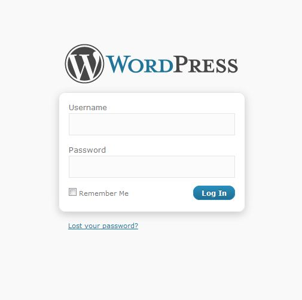
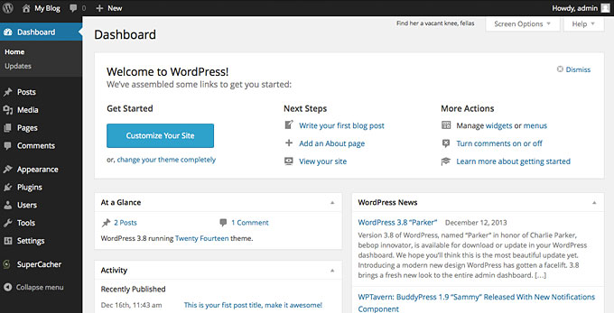

SQLite is a opensource SQL database that stores data to a text file on a device. WordPress is a free and open-source content management system written in hypertext preprocessor language and paired with a MySQL or MariaDB database with supported HTTPS.

##### ➡️ Docker image of this application consists of following layers :

```
'FROM wordpress:latest' Taking Wordpress as the base image

Used PHP scripts to 'install' the SQLite plugin and setting up the database so that the wordpress will recognize the sqlite database. 

```

### Deploy Wordpress SQLite on Scaleinfinite

➡️ Go to create apps page and Search scaleinfinite/wpsqlite on the search bar.

➡️ Click on install button. 

➡️ Fill all the reqired feilds.

| PRODUCT NAME  |
| :--------     | 
| `Wpsqlite`    |

`PROTOCOL`

| HTTP          | TCP/UDP       |
| :--------     | :--------     |
| `80,90`       | `3306,5432`   |

➡️ click on next.

| PORT NUMBER   |
| :--------     |
| `default 22`  |

➡️ click on next.

| ENV VARIABLE         |  WHITELIST                                                       |        WORKING DIR          |
| :---------           | :--------                                                        |:----------------------------| 
| `Give env variable`  | `If you want to white list any ports list here` `Example` `82`   |`WORKDIR for the application`|

➡️ Click on the Finish button.

➡️ You will be redirected to My Apps page, Here you can find all the applications you deployed.


➡️ Copy the wpsqlite application Hostname without NodePort and search the Url. 

➡️ Change the port in the starting of Url to port 80 to access the application.


➡️ Now you can see the wordpress language selection page. 


➡️ After selecting language you will be directly redirected to site creation page and fill all the fields like site name and username and so on.


➡️ Then Login with that detials.



➡️ Then you will be redirected to the wordpress Admin dashboard.




