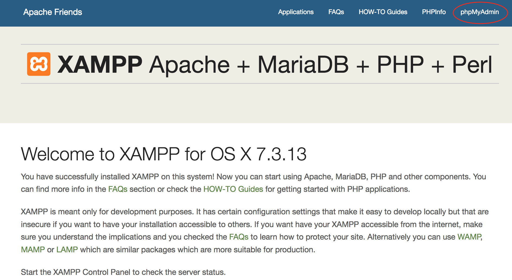
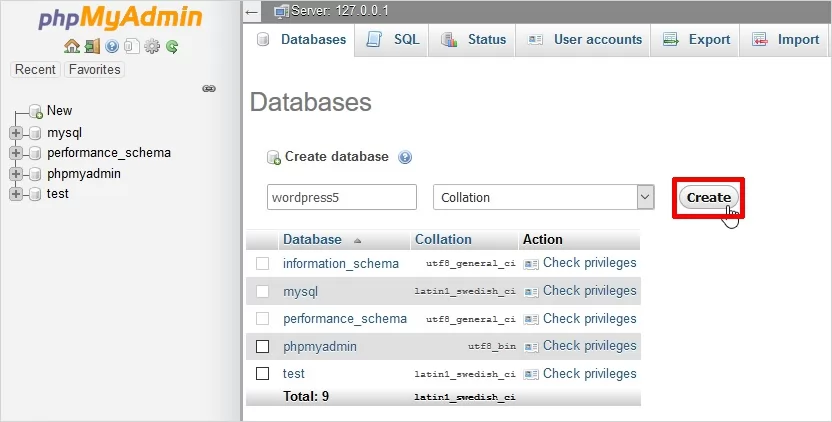
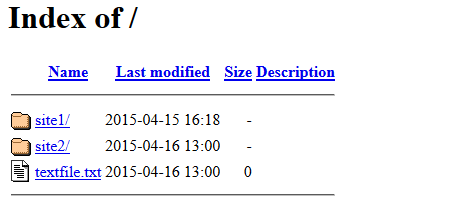

XAMPP is a free and open-source cross-platform web server solution stack package developed by Apache Friends, consisting mainly of the Apache HTTP Server, MariaDB database, and interpreters for scripts written in the PHP and Perl programming languages.

##### ➡️ Docker image of this application consists of following layers :

```
'FROM debian:buster' Taking debian:buster as the base image.

And updating and installing all the required softwares like 'openssh-server' 'supervisor' 'net-tools'

Installing the Xampp software. And configuring Xampp to Enable web interface, error display in php.

And creating a /www folder and a symbolic link to it in /opt/lampp/htdocs. This is convenient because it doesn't interfere with xampp, phpmyadmin or other tools in /opt/lampp/htdocs.

And exposing 3306, 22 and 80 ports.
```


### Deploy Xampp on Scaleinfinite

➡️ Go to create apps page and Search scaleinfinite/xampp on the search bar.

➡️ Click on install button. 

➡️ Fill all the reqired feilds.

| PRODUCT NAME  |
| :--------     | 
| `Xampp`       |

`PROTOCOL`

| HTTP          | TCP/UDP       |
| :--------     | :--------     |
| `80,90`       | `3306,5432`   |

➡️ click on next.

| PORT NUMBER   |
| :--------     |
| `default 22`  |

➡️ click on next.

| ENV VARIABLE         |  WHITELIST                                                        |        WORKING DIR          |
| :---------           | :--------                                                        |:----------------------------| 
| `Give env variable`  | `If you want to white list any ports list here` `Example` `82`   |`WORKDIR for the application`|

➡️ Click on the Finish button.

➡️ You will be redirected to My Apps page, Here you can find all the applications you deployed.


➡️ Copy the xampp application Hostname without NodePort and search the Url. 

➡️ Change the port in the starting of Url to port 80 to access the application.


➡️ You will see the Xampp interface. 



➡️ Click on PHPMyAdmin button to access the PHPMyAdmin.



➡️ Add the /www to the link to access the html application.



➡️ Now you can able to easily access and create application and edit databases in Mysql using Xampp.


